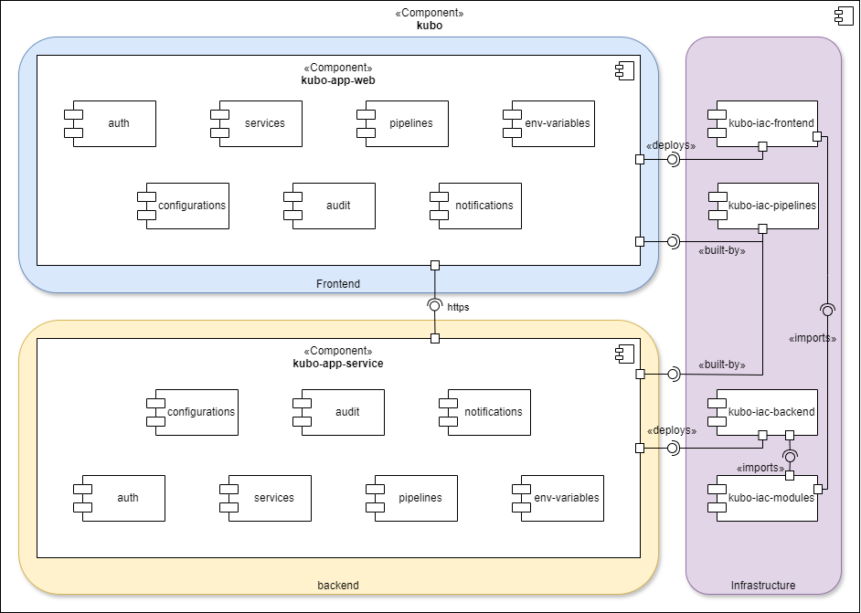

# 🏗️ Kubo Architecture Overview

## 📦 Multi-repo structure

Kubo follows a **multi-repo** architecture to promote modularity, independent versioning, and a clear separation of responsibilities across the platform. This strategy enhances both scalability and maintainability, enabling teams to work in parallel without unnecessary collisions.

Each repository is focused on a specific area of the system:

| Repository           | Description                                                                                                |
| -------------------- | ---------------------------------------------------------------------------------------------------------- |
| `kubo-docs`          | Central documentation repository: architecture decisions, APIs, processes, and repo links.                 |
| `kubo-app-web`       | Frontend application built with React + Vite. It serves as the main client for users.                      |
| `kubo-app-service`   | Modular monolithic backend built with NestJS. It encapsulates all business domains and exposes a REST API. |
| `kubo-iac-frontend`  | Infrastructure as Code (IaC) for deploying the frontend on AWS (S3 + CloudFront).                          |
| `kubo-iac-backend`   | Infrastructure as Code for backend services (ECS Fargate, RDS, etc).                                       |
| `kubo-iac-modules`   | Reusable Terraform modules shared across other IaC repos. Defines internal standards.                      |
| `kubo-iac-pipelines` | Defines CI/CD pipelines for all platform components using Terraform and automation tools.                  |

> This separation also enables an organic migration to microservices in the future, without impacting the rest of the system.

---

## 🗺️ Architecture diagram

Kubo consists of the following major components:

- **Frontend (`kubo-app-web`)**  
  Single Page Application built with React. Communicates with the backend via HTTPS using JWT for authentication. Deployed as static content to S3 and served through CloudFront.

- **Backend (`kubo-app-service`)**  
  NestJS modular application organized by business domains (Services, Pipelines, Variables, Configurations, Audit, Security, Notifications). Uses PostgreSQL and Prisma as ORM. Exposes a REST API.

- **Infrastructure (`kubo-iac-*` repositories)**  
  Fully managed through Terraform. Each environment (`develop`, `staging`, `prod`) is isolated. It includes VPC, ECS Fargate, RDS, S3, CloudFront, Secrets Manager, CloudWatch, and more.

- **CI/CD (`kubo-iac-pipelines`)**  
  Defines integration and continuous deployment flows, with differentiated policies by environment and access controls for critical actions.

> This is a **logical architecture view** focused on modular components and their relationships. Deployment-specific resources (like VPCs, ECS, ALBs, availability zones, etc.) are intentionally excluded and covered in the corresponding deployment diagrams under the `kubo-iac-*` repositories.

---

## 🔁 Components interact

1. **Frontend** authenticates users, obtains a JWT, and renders role-based content.
2. It performs HTTPS requests to the **Backend**, sending the token for authorization.
3. The **Backend** orchestrates business logic, performs database operations, and triggers events for auditing or notifications.
4. Infrastructure, via **Terraform**, ensures consistency and replicability across environments.
5. **Automated pipelines** trigger on relevant changes and deploy artifacts to the corresponding environments with validations based on the branch type.

| Source Component   | Target Component     | Interaction Type | Description                                  |
| ------------------ | -------------------- | ---------------- | -------------------------------------------- |
| `kubo-app-web`     | `kubo-app-service`   | HTTPS (REST API) | Frontend calls authenticated endpoints.      |
| `kubo-app-service` | PostgreSQL           | Prisma ORM       | Read/write domain data.                      |
| `kubo-app-service` | Secrets Manager      | Runtime config   | Securely loads secrets (e.g., DB, JWT keys). |
| `kubo-app-service` | Event Bus (future)   | Publish events   | Emits notifications, audits, etc.            |
| `kubo-app-web`     | `kubo-iac-frontend`  | Terraform deploy | Deploys frontend (S3 + CloudFront).          |
| `kubo-app-service` | `kubo-iac-backend`   | Terraform deploy | Deploys backend (ECS, RDS, etc).             |
| `kubo-app-*`       | `kubo-iac-pipelines` | CI/CD            | Build, test, and deploy automation.          |
| `kubo-iac-*`       | `kubo-iac-modules`   | Terraform module | Uses shared infra logic.                     |

---

## 🔗 Repos Documentation

- [`kubo-docs`](https://github.com/IngCarlosGM/kubo-docs) – [📄 Readme](https://github.com/IngCarlosGM/kubo-docs/blob/trunk/README.md)
- [`kubo-app-web`](https://github.com/IngCarlosGM/kubo-app-web) – [📄 Readme](https://github.com/IngCarlosGM/kubo-app-web/blob/main/README.md)
- [`kubo-app-service`](https://github.com/IngCarlosGM/kubo-app-service) – [📄 Readme](https://github.com/IngCarlosGM/kubo-app-service/blob/main/README.md)
- [`kubo-iac-frontend`](https://github.com/IngCarlosGM/kubo-iac-frontend) – [📄 Readme](https://github.com/IngCarlosGM/kubo-iac-frontend/blob/trunk/README.md)
- [`kubo-iac-backend`](https://github.com/IngCarlosGM/kubo-iac-backend) – [📄 Readme](https://github.com/IngCarlosGM/kubo-iac-backend/blob/trunk/README.md)
- [`kubo-iac-modules`](https://github.com/IngCarlosGM/kubo-iac-modules) – [📄 Readme](https://github.com/IngCarlosGM/kubo-iac-modules/blob/trunk/README.md)
- [`kubo-iac-pipelines`](https://github.com/IngCarlosGM/kubo-iac-pipelines) – [📄 Readme](https://github.com/IngCarlosGM/kubo-iac-pipelines/blob/trunk/README.md)

> Each repository includes its own detailed documentation, usage guidelines, and internal conventions.
